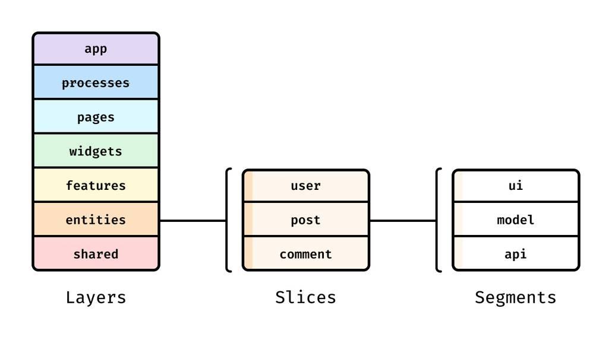

# Project Structure

### Feature Sliced Design

Project in general follows [Feature-Sliced Design](https://feature-sliced.design/) architecture with a couple of exceptions:

1. No barrel exports are used since they harm `vite` dev server performance
2. All entity definitions (schemas) and their clients (tables) are put into `shared` layer to allow cross-referencing (solution with `@x` notation mentioned [here](https://feature-sliced.design/docs/guides/examples/types#business-entities-and-their-cross-references) doesn't fit because of barrel exports absence)

### `tsconfig.json` caveats

Despite `vite` bootstraping a project the whole 3 different TS configs (`tsconfig.json`, `tsconfig.app.json`, `tsconfig.node.json`) I decided to go with a single one. The reason for it is to re-use code from main client-side code (`src` dir) in server-side code (`scripts` and `e2e` dirs, root repo configs).

Attempts to configure tsconfig project references, so the server code references client code results in the following error:

> [!CAUTION]
> Referenced project '.../tsconfig.app.json' may not disable emit.

No tsconfig paths are used, because there are many different ways how code is executed:

- client and unit tests code are executed via `vite` dev server and whatever it uses under the hood
- scripts are executed via `tsx`
- e2e tests code is executed by `playwright`

To avoid potential problems with under-the-hood compilers and/or bundlers not supporting tsconfig paths its better to simply avoid using them

> [!IMPORTANT]
> There are still differences between mentioned above code executors. For example since `playwright` doesn't support JSX none of e2e test files can import neither TSX neither TS files that under-the-hood import TSX
